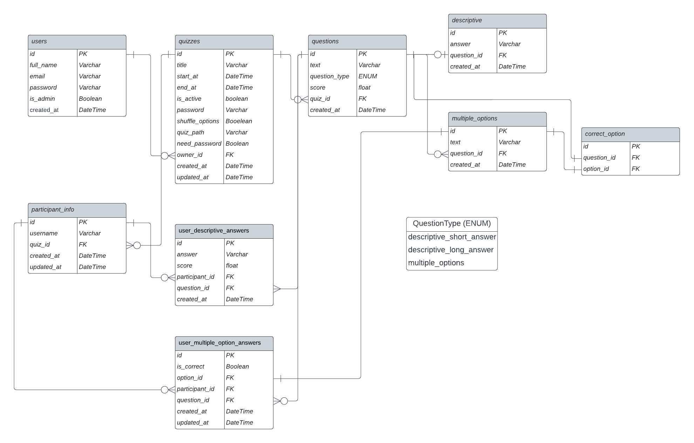

# quiz-builder

This application allows users to create, manage, and participate in quizzes


# Installation Guide
1 - install packages
```
   potery install
```
2 - run migrations on database (provide database url in .env)
```
   poetry run alembic upgrade head
```
3 - run uvicorn
```
   poetry run python -m src.main
```

# Features
- Jwt for authentication
- SQLAlchemy for database operations
- Redis is used for user registration and storing verify codes
- Implementation of Controller and repository pattern
- Pytest for app unittests

# SQL Tables
